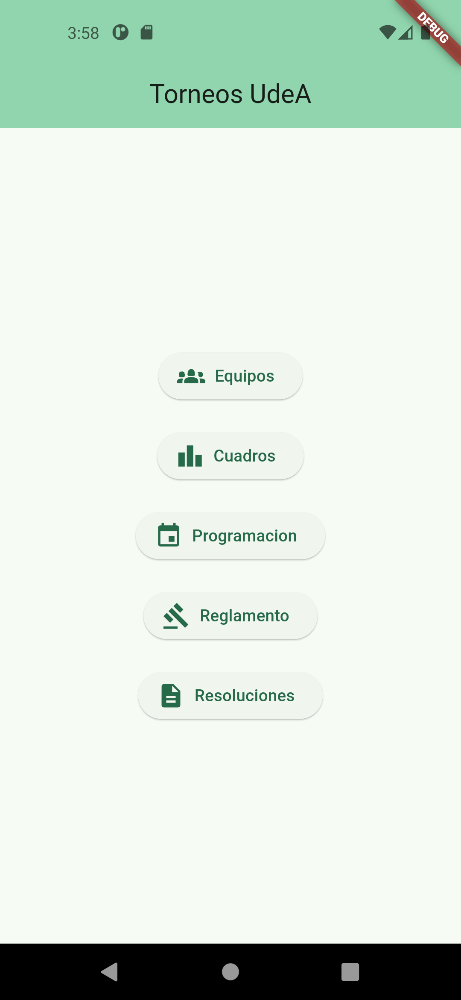
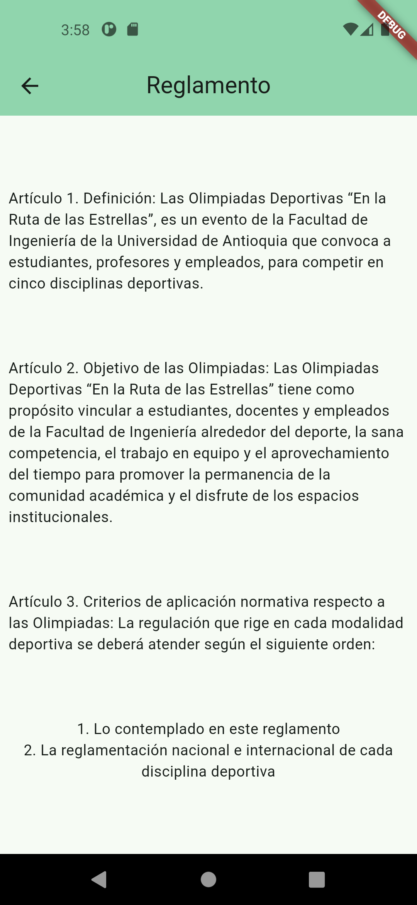
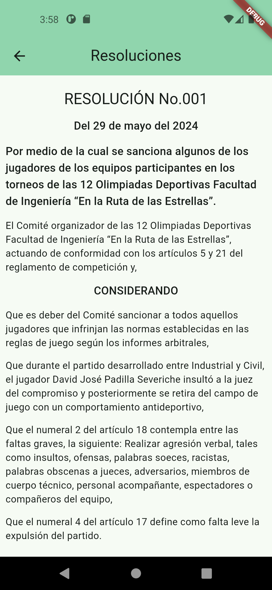

# 🛠️ Proyecto: Torneos UdeA

[](https://flutter.dev)


[](https://github.com/DevmenteSac/flutter-cicd/actions/workflows/build.yml)






## 📖 Descripción General

Este proyecto fue desarrollado para la Universidad de Antioquia, con el objetivo de gestionar de forma digital los torneos universitarios. Incluye módulos como programación, reglamentos, equipos participantes, cuadros de posiciones y resoluciones. Está diseñado para funcionar en dispositivos Android e iOS.

**Estado Actual:** En desarrollo

**Última Actualización:** Mayo 2025

## 🚀 Características Principales

- ✅ Visualización de equipos y participantes
- ✅ Cuadros de posiciones
- ✅ Programación de encuentros por modalidad
- ✅ Acceso al reglamento oficial y resoluciones emitidas
- 🛡️ Gestión centralizada de datos desde una fuente controlada

<!-- 
## 📂 Estructura del Proyecto

```plaintext
root/
├── lib/                  # Código fuente principal
├── assets/               # Recursos como imágenes, fuentes, etc.
├── test/                 # Pruebas automatizadas
├── config/               # Archivos de configuración
├── scripts/              # Scripts de despliegue o utilitarios
├── README.md             # Este archivo
```
 -->

## 🛠️ Requisitos Técnicos

### 1. Entorno de Desarrollo:

- Flutter SDK: >= 3.5.3
- Dart: >= 3.1.0
- IDE recomendado: VS Code/Android Studio

### 2. Dependencias Clave:

- `go_router` - Navegación declarativa

- `MVVM` - Arquitectura

- `http` - Consumo de servicios REST

### 3. Servicios de Terceros:

- Firebase - Autenticación y hosting de archivos reglamentarios

## 🔧 Configuración Inicial

1. Clona este repositorio:

```bash
git clone https://github.com/sebudea/torneos-udea
```

2. Navega al directorio:

```bash
cd torneos-udea
```

3. Instala las dependencias:

```bash
flutter pub get
```

4. Ejecuta la aplicación:

```bash
flutter run
```

## 📦 Despliegue

### 📍 Entorno de Producción

1. Corre el siguiente script para construir la app:

```bash
flutter build appbundle --obfuscate --split-debug-info=build/app/outputs/bundle/release
```

```bash
flutter build apk --release
```

### 📍 Entorno de Pruebas (Staging)

1. Genera el build para pruebas:

```bash
flutter build apk --debug
```


## 🔍 Pruebas

- Ejecutar todas las pruebas unitarias:

```bash
flutter test
```

## 🔄 Mantenimiento

1. Actualización de Dependencias:

```bash
flutter pub upgrade
```

2. Limpieza de Caché:

```bash
flutter clean
```

## 📞 Contacto y Soporte

- **Desarrollador Responsable**: Sebastian Aristizabal Castañeda, Alejandro Cifuentes, Alejandro Arias Ortiz
- **GitHub**: [Sebastian](https://github.com/sebudea), [Alejandro Cifuentes](https://github.com/cifu0426), [Alejandro Arias](https://github.com/AlejoAriasO)


## 📝 Licencia
Este proyecto es privado y no está disponible para distribución pública. Todos los derechos reservados por sebudea.